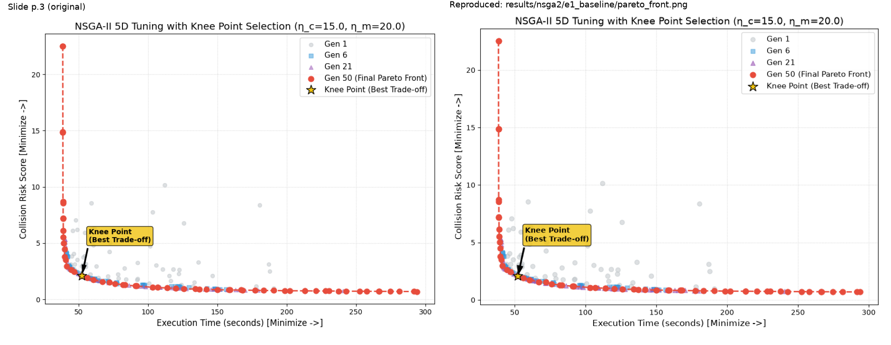
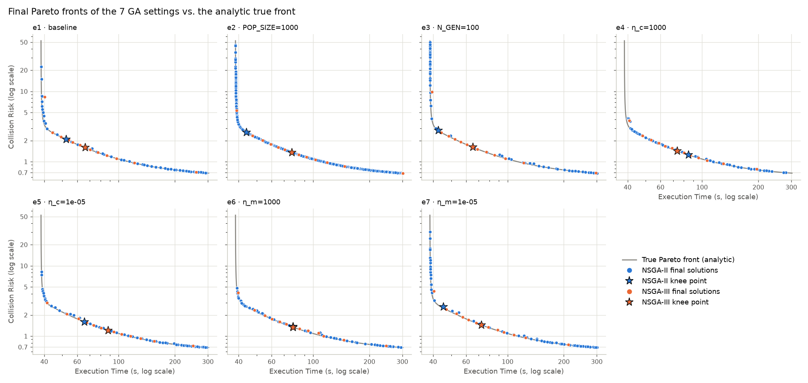
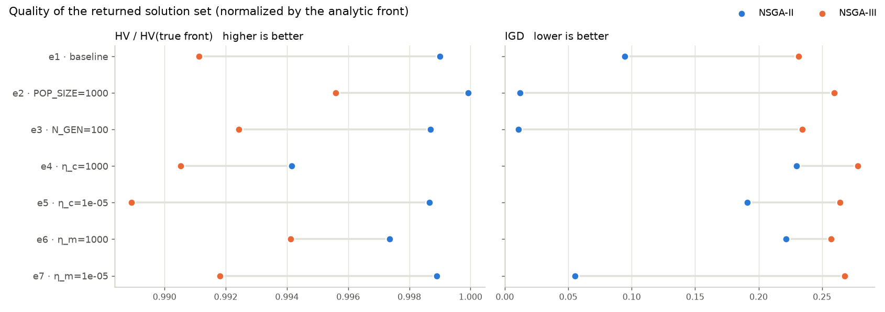
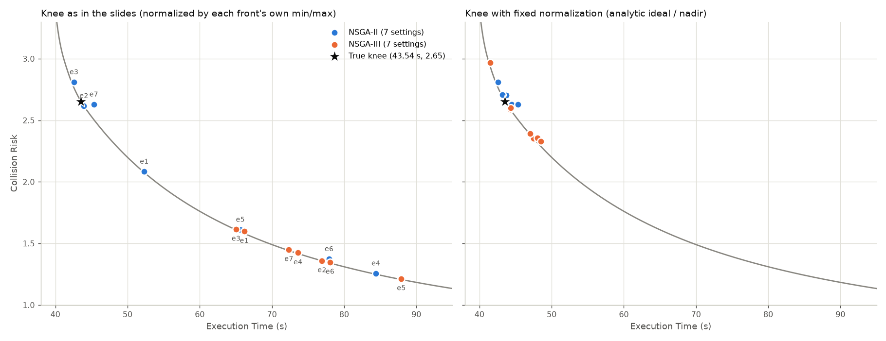
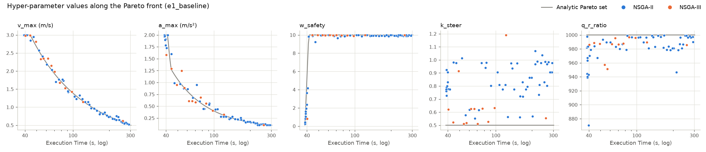
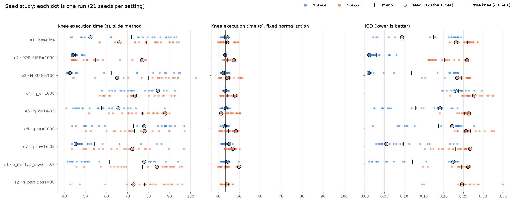

# AMR 5 維超參數多目標最佳化（NSGA-II / NSGA-III）：簡報結果重現

依據 `超參數優化.pptx` 重建程式，重現簡報中 NSGA-II（p.3–9）與 NSGA-III（p.13–19）共 14 組實驗：帕累托前緣圖、帕累托解表格與膝點（Knee Point）。程式、設定、所有結果圖與數據都放在本資料夾內。

測試環境：WSL2、Python 3.12.14、pymoo 0.6.2、numpy 2.5.3、matplotlib 3.11.2。只用 CPU，不需要 GPU。

---

## 1. 重現結果摘要

**14 組全部與簡報完全一致**：每張結果頁的帕累托解表格（前 5 列，每列 7 個數值）與膝點（5 個超參數 + 2 個目標值）逐字相同，前緣圖上的每個點也相同。比對由 `scripts/verify_slides.py` 直接解析 pptx 的文字完成，結果見 [reproduction_check.md](results/reproduction_check.md)。

| 設定（簡報編號） | POP_SIZE | N_GEN | η_c | η_m | NSGA-II 膝點（時間 s, 風險） | NSGA-III 膝點（時間 s, 風險） | 比對 |
|---|---|---|---|---|---|---|---|
| e1 基準 (1) | 60 | 50 | 15 | 20 | p.3：52.32, 2.08 | p.13：66.16, 1.60 | ✅ |
| e2 族群放大 (2) | **1000** | 50 | 15 | 20 | p.4：43.96, 2.62 | p.14：76.93, 1.36 | ✅ |
| e3 代數加倍 (3) | 60 | **100** | 15 | 20 | p.5：42.58, 2.81 | p.15：65.03, 1.61 | ✅ |
| e4 交叉保守 (4) | 60 | 50 | **1000** | 20 | p.6：84.39, 1.26 | p.16：73.60, 1.42 | ✅ |
| e5 交叉激進 (5) | 60 | 50 | **1e-5** | 20 | p.7：65.62, 1.61 | p.17：87.92, 1.21 | ✅ |
| e6 突變保守 (6) | 60 | 50 | 15 | **1000** | p.8：77.92, 1.37 | p.18：78.05, 1.35 | ✅ |
| e7 突變劇烈 (7) | 60 | 50 | 15 | **1e-5** | p.9：45.32, 2.63 | p.19：72.35, 1.45 | ✅ |



- **還原方式**：簡報只有參數與輸出，沒有亂數種子與套件版本。p.11 的程式碼對照顯示原程式使用 pymoo；逐一測試後確認是 **pymoo 0.6.2 + `seed=42`**，運算子為 `FloatRandomSampling`、`SBX(prob=0.9, eta=η_c)`、`PM(prob=0.2, eta=η_m)`、`eliminate_duplicates=True`。NSGA-III 的參考點為 `das-dennis`、`n_partitions=12`（13 條射線，同 p.20）。膝點使用 p.2 的方法一：以前緣自身的最小/最大值正規化，取距離 (0, 0) 最近的解。
- **套件版本必須相同**：pymoo 0.6.1.x 的亂數機制不同，seed=42 會得到完全不同的結果（0.6.1.6 的 NSGA-II 基準膝點是 95.1 s）；0.6.1.3 在 numpy 2.5 下甚至無法執行。`requirements.txt` 已鎖定 `pymoo==0.6.2`。
- **圖的版面也相同**：原圖是 Jupyter 的輸出（figsize=(10, 7)、dpi=100、`bbox_inches="tight"`），中間代數畫第 1 代以及 N_GEN 的 10%、40% 處（N_GEN=50 → 第 1/6/21 代，N_GEN=100 → 第 1/11/41 代）。14 張並排對照圖在 [results/figures/slide_compare/](results/figures/slide_compare/)。
- 同一台機器重跑 `run_all.sh`，所有數值逐位元相同。

---

## 2. 資料夾結構

```
Hyper_parameter_opt/
├── README.md
├── 超參數優化.pptx              原始簡報（verify_slides.py 直接讀取）
├── run_all.sh                   一鍵重現全部流程（約 6 分鐘）
├── requirements.txt
├── configs/
│   └── experiments.yaml         7 組簡報設定（e1–e7）與 2 組建議實驗（s1、s2）
├── amr_moo/                     共用模組
│   ├── problem.py               AMR 黑盒評價方程（5 個超參數 → 執行時間、碰撞風險）與變數邊界
│   ├── algorithms.py            「GA 參數可調區域」預設值、NSGA-II / NSGA-III 建構與執行
│   ├── knee.py                  膝點法
│   ├── console.py               與簡報相同格式的文字輸出
│   ├── true_front.py            理論帕累托前緣（解析解，指標計算用）
│   ├── metrics.py               HV、IGD
│   └── plotting.py              簡報樣式的帕累托前緣圖、收斂圖
├── scripts/
│   ├── run_experiment.py        執行實驗（全部、單組或自訂參數）
│   ├── verify_slides.py         與簡報逐項比對，產生並排對照圖
│   ├── make_report.py           彙整表與比較圖
│   └── seed_study.py            多種子研究（建議，非簡報內容）
├── results/
│   ├── nsga2/<實驗>/、nsga3/<實驗>/   每組實驗的輸出（見 §5.1）
│   ├── reproduction_check.{md,csv}   與簡報的比對結果
│   ├── summary.{md,csv}              14 組彙整：膝點、HV、IGD、解的範圍、執行時間
│   ├── seed_study/                    多種子研究：runs.csv（每次執行）、summary.{md,csv}
│   └── figures/                       比較圖；slide_compare/ 為簡報原圖 vs 重現圖
└── logs/run_all.log                   最近一次 run_all.sh 的完整輸出
```

---

## 3. 部署方式

**本機**（套件已裝在 `common_env`）：

```bash
conda activate common_env
cd /home/david/Hyper_parameter_opt
./run_all.sh            # 約 6 分鐘，其中多種子研究約 5 分鐘；SEEDS=5 ./run_all.sh 可縮短
```

**新機器**：

```bash
conda create -n amr_moo python=3.12 -y && conda activate amr_moo
pip install -r requirements.txt
./run_all.sh
```

- 除了安裝套件，執行時不需要網路。
- 要得到和簡報相同的數字，必須使用 pymoo 0.6.2；其他套件版本不影響數值。
- 沒有 bash（例如 Windows）時，依序執行 §4.1 表格中的四個 python 指令即可。

---

## 4. 使用方式

### 4.1 分步執行

| 步驟 | 指令 | 產出 |
|---|---|---|
| 1 實驗 | `python scripts/run_experiment.py --all` | `results/nsga2/`、`results/nsga3/`（14 組） |
| 2 比對 | `python scripts/verify_slides.py` | `results/reproduction_check.md`、`results/figures/slide_compare/` |
| 3 報告 | `python scripts/make_report.py` | `results/summary.md`、`results/figures/*.png` |
| 4 多種子 | `python scripts/seed_study.py --seeds 20` | `results/seed_study/`、`results/figures/seed_study.png` |

### 4.2 修改 GA 參數

參數有三個來源，後者覆寫前者：

1. `amr_moo/algorithms.py` 的 `DEFAULTS`：即簡報的「GA 參數可調區域」（POP_SIZE、N_GEN、CROSSOVER_PROB、ETA_C、MUTATION_PROB、ETA_M），另有 `n_partitions`、`seed`。
2. `configs/experiments.yaml`：每組實驗只寫和預設值不同的參數。
3. 命令列參數：

```bash
python scripts/run_experiment.py --algo nsga2 --exp e4_etac1000                        # 只跑一組
python scripts/run_experiment.py --algo nsga3 --pop-size 200 --eta-m 5 --name my_test  # 自訂 → results/nsga3/my_test/
python scripts/run_experiment.py --algo nsga2 --exp e1_baseline --seed 7 --name e1_seed7
```

可用參數：`--pop-size --n-gen --crossover-prob --eta-c --mutation-prob --mutation-prob-var --eta-m --n-partitions --seed`。

### 4.3 在 Python 中使用、換成真實的評價函數

```python
import sys; sys.path.insert(0, "/home/david/Hyper_parameter_opt")
from amr_moo import run, knee_point_index, console_report

res, params, sec = run("nsga2", {"pop_size": 100, "n_gen": 80})
k = knee_point_index(res.F)
print(console_report(res.X, res.F, k))   # 與簡報相同格式的表格與膝點
print(res.X[k], res.F[k])                # 膝點的 5 個超參數與 2 個目標值
```

黑盒評價方程在 `amr_moo/problem.py` 的 `amr_objectives()`。要接真實的 AMR 模擬器或實測資料，改寫這個函數（輸入 5 個超參數，回傳執行時間與碰撞風險）；變數邊界改 `XL`、`XU`。

---

## 5. 各指標結果圖

### 5.1 每組實驗的輸出

`results/<nsga2|nsga3>/<實驗>/` 內含：

| 檔案 | 內容 |
|---|---|
| `pareto_front.png` | 帕累托前緣、第 1/中間代的族群、膝點（同簡報的圖） |
| `console_output.txt` | 帕累托解表格前 5 列與膝點（同簡報的文字輸出） |
| `pareto_solutions.csv` | 最終全部的解（5 個超參數 + 2 個目標值），並標記膝點 |
| `generation_metrics.csv`、`convergence.png` | 每一代解集合的 HV、IGD、解的個數與目標值範圍 |
| `summary.json` | 完整參數、套件版本、執行時間、膝點、指標 |

| 設定 | NSGA-II | NSGA-III |
|---|---|---|
| e1 基準 | [前緣圖](results/nsga2/e1_baseline/pareto_front.png) · [收斂](results/nsga2/e1_baseline/convergence.png) | [前緣圖](results/nsga3/e1_baseline/pareto_front.png) · [收斂](results/nsga3/e1_baseline/convergence.png) |
| e2 POP_SIZE=1000 | [前緣圖](results/nsga2/e2_pop1000/pareto_front.png) · [收斂](results/nsga2/e2_pop1000/convergence.png) | [前緣圖](results/nsga3/e2_pop1000/pareto_front.png) · [收斂](results/nsga3/e2_pop1000/convergence.png) |
| e3 N_GEN=100 | [前緣圖](results/nsga2/e3_gen100/pareto_front.png) · [收斂](results/nsga2/e3_gen100/convergence.png) | [前緣圖](results/nsga3/e3_gen100/pareto_front.png) · [收斂](results/nsga3/e3_gen100/convergence.png) |
| e4 η_c=1000 | [前緣圖](results/nsga2/e4_etac1000/pareto_front.png) · [收斂](results/nsga2/e4_etac1000/convergence.png) | [前緣圖](results/nsga3/e4_etac1000/pareto_front.png) · [收斂](results/nsga3/e4_etac1000/convergence.png) |
| e5 η_c=1e-5 | [前緣圖](results/nsga2/e5_etac1e-5/pareto_front.png) · [收斂](results/nsga2/e5_etac1e-5/convergence.png) | [前緣圖](results/nsga3/e5_etac1e-5/pareto_front.png) · [收斂](results/nsga3/e5_etac1e-5/convergence.png) |
| e6 η_m=1000 | [前緣圖](results/nsga2/e6_etam1000/pareto_front.png) · [收斂](results/nsga2/e6_etam1000/convergence.png) | [前緣圖](results/nsga3/e6_etam1000/pareto_front.png) · [收斂](results/nsga3/e6_etam1000/convergence.png) |
| e7 η_m=1e-5 | [前緣圖](results/nsga2/e7_etam1e-5/pareto_front.png) · [收斂](results/nsga2/e7_etam1e-5/convergence.png) | [前緣圖](results/nsga3/e7_etam1e-5/pareto_front.png) · [收斂](results/nsga3/e7_etam1e-5/convergence.png) |

### 5.2 指標的定義：以理論帕累托前緣為基準

這個評價方程在邊界內是凸函數，所以整條真實前緣可以用加權和求出解析解（`amr_moo/true_front.py`）。兩個目標以理論前緣的 ideal (38.46 s, 0.69) 與 nadir (303.1 s, 52.45) 正規化到 0~1，再計算：

- **HV 比例**（越大越好）：解集合的 Hypervolume ÷ 理論前緣的 Hypervolume，參考點 (1.1, 1.1)。
- **IGD**（越小越好）：理論前緣上 1000 個等距點到解集合的平均最近距離，同時反映收斂程度與覆蓋範圍。

### 5.3 前緣比較



灰線為理論前緣（對數座標）。所有解都貼在理論前緣上，差別在**覆蓋範圍**：NSGA-II 在 e2、e3、e7 能延伸到左上方的高風險段，NSGA-III 的 13 個解則集中在中段。

### 5.4 品質指標（seed=42，與簡報同一次執行）



| 設定 | NSGA-II HV 比例 / IGD | NSGA-III HV 比例 / IGD | NSGA-II / NSGA-III 前緣最高風險 |
|---|---|---|---|
| e1 基準 | 0.9990 / 0.095 | 0.9911 / 0.232 | 22.5 / 8.4 |
| e2 POP_SIZE=1000 | **0.9999 / 0.012** | 0.9956 / 0.260 | 45.8 / 5.3 |
| e3 N_GEN=100 | 0.9987 / **0.011** | 0.9924 / 0.235 | 49.7 / 9.9 |
| e4 η_c=1000 | 0.9941 / 0.230 | 0.9905 / 0.278 | 4.2 / 3.8 |
| e5 η_c=1e-5 | 0.9987 / 0.191 | 0.9889 / 0.264 | 8.2 / 3.0 |
| e6 η_m=1000 | 0.9974 / 0.222 | 0.9941 / 0.257 | 4.8 / 4.1 |
| e7 η_m=1e-5 | 0.9989 / 0.055 | 0.9918 / 0.268 | 30.5 / 4.4 |

完整數字（解的個數、時間範圍、評估次數、執行時間）見 [results/summary.md](results/summary.md)。每一代的 IGD 變化見 [convergence_igd.png](results/figures/convergence_igd.png)。

### 5.5 膝點



左圖是簡報的方法，14 個膝點分散在 42.6–87.9 s；右圖改用固定的正規化基準（理論 ideal / nadir），NSGA-II 的膝點全部落在 42.6–45.3 s，接近理論膝點 (43.54 s, 2.65)。原因見 §6.3。

### 5.6 超參數沿前緣的分布



灰線為理論上的最佳超參數（隨執行時間變化），點為 e1 基準的解。v_max、a_max、w_safety 貼近理論值；k_steer 與 q_r_ratio 則明顯分散（理論上應固定在 0.5 與 1000）。

---

## 6. 結果解讀

### 6.1 真實前緣的形狀：先加安全權重，再降速度

理論解顯示 **k_steer 永遠取下限 0.5、q_r_ratio 永遠取上限 1000**（它們只出現在一個目標中，沒有取捨）。前緣呈 L 形：

- **垂直段**（38.5–41.2 s）：v_max=3、a_max=2 都在上限，只把 w_safety 從 0.1 提高到約 9.1，風險就從 52.5 降到 3.0，時間只多 2.7 秒。
- **水平段**（41.2–303 s）：w_safety 到上限 10 之後，先降低 a_max（41.2 s 起），再降低 v_max（44.3 s 起）。時間大幅增加，風險只再降到 0.69。
- 理論膝點：v_max=3.00、a_max=1.41、w_safety=10、k_steer=0.5、q_r_ratio=1000 → 43.54 s、風險 2.65。

k_steer 與 q_r_ratio 對目標值的影響很小（k_steer 從 0.5 到 1.2 只讓時間多 0.14 s），GA 的選擇壓力不足，50 代內收斂不完全，這就是 §5.6 中這兩個變數分散的原因。

### 6.2 NSGA-II 與 NSGA-III：為什麼 NSGA-III 集中在中段

- pymoo 的 NSGA-III 在 `res.F` 中只回傳「每條參考射線最近的一個解」，所以最多 13 個解；NSGA-II 回傳整個第一前緣（60 或 1000 個）。
- 即使取出 NSGA-III 的整個族群（`res.pop`，60 個非支配解），最高風險仍只有 8.4（NSGA-II 為 22.5），IGD 只從 0.232 改善到 0.207。13 條射線在正規化空間中大多打在 L 形的轉角附近，族群本身就沒有往垂直段延伸。這和簡報 p.20 的解析一致。
- 對 M=2 的問題，NSGA-II 的覆蓋率明顯較好（§5.4 每一組 IGD 都較低）；NSGA-III 的優勢在 M ≥ 4（簡報 p.21）。

### 6.3 膝點會隨前緣的最高風險移動

簡報的膝點以「各自前緣的最小/最大值」正規化。風險軸的最大值取決於前緣往垂直段延伸了多遠（上表 2.97–49.7），最大值越小，風險軸被放大越多，膝點就越往右（時間長、風險低）移：

| 前緣最高風險 | 例子 | 簡報方法的膝點 | 固定正規化的膝點 |
|---|---|---|---|
| 49.7 | NSGA-II e3 | 42.58 s | 42.58 s |
| 22.5 | NSGA-II e1 | 52.32 s | 44.49 s |
| 4.2 | NSGA-II e4 | 84.39 s | 43.40 s |
| 3.0 | NSGA-III e5 | 87.92 s | 41.47 s |

所以簡報中各組膝點的差異（例如 e1 的 52.3 s vs e4 的 84.4 s），大部分來自前緣上端停在哪裡，而不是交叉/突變參數讓「最佳折衷」本身改變。

### 6.4 換種子之後結論還成立嗎（多種子研究）

每組設定跑 21 個種子（0–19 與 42），完整結果見 [results/seed_study/summary.md](results/seed_study/summary.md)：



| 設定（NSGA-II） | 膝點：簡報方法 (s) | 膝點：固定正規化 (s) | IGD |
|---|---|---|---|
| e1 基準 | 71.8 ± 17.9（42.9–93.3） | 43.20 ± 1.09 | 0.174 ± 0.082 |
| e2 POP_SIZE=1000 | 45.4 ± 1.9 | 43.57 ± 0.24 | **0.029 ± 0.021** |
| e3 N_GEN=100 | 62.2 ± 22.0 | 43.25 ± 1.40 | 0.118 ± 0.105 |
| e4 η_c=1000 | 74.5 ± 9.8 | 43.74 ± 0.81 | 0.239 ± 0.023 |
| e5 η_c=1e-5 | 57.5 ± 12.1 | 43.41 ± 1.25 | 0.129 ± 0.073 |
| e6 η_m=1000 | 72.9 ± 18.6 | 43.53 ± 0.95 | 0.188 ± 0.074 |
| e7 η_m=1e-5 | 54.1 ± 12.8 | 43.50 ± 1.39 | 0.097 ± 0.067 |

- **只換種子，簡報方法的膝點就在 42.9–93.3 s 之間跳動**；seed=42 的 52.3 s 只是其中一次。單一種子的膝點不能用來比較參數好壞。
- 固定正規化後，NSGA-II 所有設定的膝點平均都是 43.2–43.7 s（標準差 0.2–1.4 s），和理論膝點 43.54 s 一致。
- 和 e1 相比、差異明顯大於種子波動的結論：**族群放大（e2）最有效**，IGD 最低且變異最小；η_m=1e-5（e7，突變擾動大）覆蓋率較好；η_c=1000（e4，交叉保守）覆蓋率較差。代數加倍（e3）與 η_c=1e-5（e5）只略有改善，η_m=1000（e6）看不出差異。另外 η_c=1e-5 時 k_steer 更難收斂（中位數 1.29）。
- NSGA-III 在各設定的 IGD 平均都是 0.20–0.28；除了族群 1000（前緣最高風險平均 24.9）之外，最高風險平均只有 4.5–10.1，集中在中段是穩定的特性。

---

## 7. 建議

1. **膝點改用固定的正規化基準**：`knee_point_index(F, ideal, nadir)` 可以傳入固定的 ideal / nadir。實務上沒有理論前緣時，可以用工程上可接受的範圍（例如時間 30–300 s、風險 0–10），或把多次執行的解合併後再取 min/max。也可以只在實際可用的區間（例如風險 ≤ 5）內找膝點。
2. **比較 GA 參數時跑多個種子**：至少 10–20 個種子，報告平均 ± 標準差（`scripts/seed_study.py`）。
3. **注意 pymoo 的突變機率語意**：簡報註解寫「MUTATION_PROB 建議設為 1/n_var = 0.2」，但 `PM(prob=0.2)` 在 pymoo 中是「每個個體被突變的機率」，每個維度再以 1/n_var=0.2 突變，實際每個維度只有 0.04。若要每個維度 0.2，設 `mutation_prob: 1.0, mutation_prob_var: 0.2`（建議實驗 s1）：NSGA-II 的 IGD 平均從 0.174 降到 0.121（約改善 30%，但各種子之間差異仍大），前緣最高風險平均從 13.1 提高到 23.6。SBX 同理：`prob=0.9` 是每對父代進行交叉的機率，被選中後每個維度再以 `prob_var=0.5` 的機率進行交叉。
4. **兩個目標時用 NSGA-II**：簡報 p.20 建議把 NSGA-III 的 n_partitions 提高到 24–30。實測 n_partitions=30（建議實驗 s2，31 條射線）IGD 只從 0.261 降到 0.250，最高風險平均 5.9，仍集中在中段。要保留 NSGA-III 的更多解，可改用 `res.pop` 而不是 `res.F`。
5. **把 k_steer 固定在 0.5、q_r_ratio 固定在 1000**：在這個評價方程下它們沒有取捨，固定後問題降為 3 維，收斂更快，也避免 §5.6 那種沒收斂的值出現在推薦參數中。換成真實模擬器之後，要先確認這個性質是否仍成立。
6. **接真實模擬器時**：評估次數是 POP_SIZE × N_GEN（e2 為 50,000 次）。模擬很慢時，可用 pymoo 的平行評估（`ElementwiseProblem` 的 `elementwise_runner` 搭配 `pymoo.parallelization.starmap.StarmapParallelization`），或改用樣本效率較高的方法（例如 Optuna 的多目標 TPE、貝氏最佳化）。模擬有隨機性時，每組參數應重複評估取平均。

---

## 8. 常見問題

- **為什麼 NSGA-III 的前緣圖只有 13 個紅點？** 見 §6.2，這是 pymoo NSGA-III 的 `res.F` 定義，簡報的圖也是如此。
- **YAML 中的 1e-5**：PyYAML 會把 `1e-5` 讀成字串，所以 `configs/experiments.yaml` 寫成 `0.00001`（或寫 `1.0e-5`）。
- **圖中文字為英文**：與原圖相同，也避免其他電腦缺少中文字型。matplotlib 的字型快取放在專案內的 `.cache/`（由 `run_all.sh` 設定）。
- **HV 比例都接近 1**：前緣是 L 形，支配區幾乎是整個方框，所以 HV 比例都在 0.989–1.000 之間；比較覆蓋範圍時 IGD 比較敏感。IGD 會因為缺少垂直段（高風險、實務上用不到的區域）而變大，解讀時請搭配 §5.3 的圖。
- **執行時間**：`summary.json` 的 `runtime_sec` 是最佳化本身的秒數（含保存每一代族群）：POP_SIZE=60 約 0.6 s，POP_SIZE=1000 約 10 s。
